# Buyer Journey Data Flow Diagram

This document describes the complete data flow for the buyer journey in the AgroHaat platform.

## Data Flow Diagram (Mermaid Format)

```mermaid
flowchart TD
    Start([Buyer Visits Platform]) --> Auth{Authenticated?}
    
    Auth -->|No| Register[Registration Page]
    Auth -->|Yes| Dashboard[Buyer Dashboard]
    
    Register --> RegisterForm[Fill Registration Form]
    RegisterForm --> ValidateReg{Validation}
    ValidateReg -->|Invalid| RegisterForm
    ValidateReg -->|Valid| CreateUser[Create User Account]
    CreateUser --> LoginPage[Login Page]
    
    LoginPage --> LoginForm[Enter Credentials]
    LoginForm --> VerifyAuth{Verify Credentials}
    VerifyAuth -->|Invalid| LoginForm
    VerifyAuth -->|Valid| CreateSession[Create Session]
    CreateSession --> Dashboard
    
    Dashboard --> Browse[Browse Products]
    Browse --> Search[Search Products]
    Search --> ApplyFilters[Apply Filters]
    ApplyFilters --> FilterResults{Filter Results}
    FilterResults -->|Category| FilterByCategory[Filter by Category]
    FilterResults -->|Location| FilterByLocation[Filter by District]
    FilterResults -->|Price| FilterByPrice[Filter by Price Range]
    FilterResults -->|Quality| FilterByQuality[Filter by Quality Grade]
    
    FilterByCategory --> ProductList[Display Products]
    FilterByLocation --> ProductList
    FilterByPrice --> ProductList
    FilterByQuality --> ProductList
    
    ProductList --> ViewProduct[View Product Details]
    ViewProduct --> QRScan{Scan QR Code?}
    
    QRScan -->|Yes| QRScanner[QR Code Scanner]
    QRScanner --> CameraScan{Camera Scan}
    CameraScan -->|Success| ExtractTraceID[Extract Trace ID]
    CameraScan -->|Fail| UploadImage[Upload Image]
    UploadImage --> ScanImage[Scan from Image]
    ScanImage --> ExtractTraceID
    QRScan -->|No| AddToCart[Add to Cart]
    
    ExtractTraceID --> TracePage[Traceability Page]
    TracePage --> DisplayTrace[Display Product Trace Info]
    DisplayTrace --> AddToCart
    
    AddToCart --> CartPage[Cart Page]
    CartPage --> ReviewCart[Review Cart Items]
    ReviewCart --> Checkout[Proceed to Checkout]
    
    Checkout --> EnterAddress[Enter Shipping Address]
    EnterAddress --> CreateOrder[Create Order]
    CreateOrder --> OrderCreated{Order Created?}
    OrderCreated -->|Fail| EnterAddress
    OrderCreated -->|Success| SelectPayment[Select Payment Method]
    
    SelectPayment --> PaymentMethod{Payment Type}
    PaymentMethod -->|bKash| BKashPayment[bKash Payment]
    PaymentMethod -->|Nagad| NagadPayment[Nagad Payment]
    PaymentMethod -->|Rocket| RocketPayment[Rocket Payment]
    PaymentMethod -->|Card| CardPayment[Card Payment]
    PaymentMethod -->|Bank| BankTransfer[Bank Transfer]
    
    BKashPayment --> EnterTransactionID[Enter Transaction ID]
    NagadPayment --> EnterTransactionID
    RocketPayment --> EnterTransactionID
    CardPayment --> EnterCardDetails[Enter Card Details]
    BankTransfer --> EnterBankDetails[Enter Bank Details]
    
    EnterTransactionID --> SubmitPayment[Submit Payment]
    EnterCardDetails --> SubmitPayment
    EnterBankDetails --> SubmitPayment
    
    SubmitPayment --> CreatePaymentRecord[Create Payment Record]
    CreatePaymentRecord --> UpdateOrderStatus[Update Order Status: PENDING]
    UpdateOrderStatus --> PaymentPending[Payment Status: PENDING]
    PaymentPending --> AdminVerify[Admin Verification]
    AdminVerify --> PaymentApproved{Payment Approved?}
    PaymentApproved -->|Yes| UpdatePaymentStatus[Update Payment Status: PAID]
    PaymentApproved -->|No| PaymentRejected[Payment Rejected]
    PaymentRejected --> SelectPayment
    
    UpdatePaymentStatus --> UpdateOrderPaid[Update Order Status: PAID]
    UpdateOrderPaid --> CreateDeliveryJob[Create Delivery Job]
    CreateDeliveryJob --> OrderTracking[Order Tracking]
    
    OrderTracking --> TrackStatus[Track Order Status]
    TrackStatus --> StatusCheck{Current Status}
    StatusCheck -->|PENDING| ShowPending[Show: Order Pending]
    StatusCheck -->|PAID| ShowPaid[Show: Payment Confirmed]
    StatusCheck -->|PROCESSING| ShowProcessing[Show: Order Processing]
    StatusCheck -->|SHIPPED| ShowShipped[Show: Order Shipped]
    StatusCheck -->|DELIVERED| ShowDelivered[Show: Order Delivered]
    
    ShowPending --> PurchaseHistory[Purchase History]
    ShowPaid --> PurchaseHistory
    ShowProcessing --> PurchaseHistory
    ShowShipped --> PurchaseHistory
    ShowDelivered --> PurchaseHistory
    
    PurchaseHistory --> ViewOrderDetails[View Order Details]
    ViewOrderDetails --> ViewPaymentHistory[View Payment History]
    ViewPaymentHistory --> End([End])
    
    style Start fill:#e1f5ff
    style End fill:#e1f5ff
    style Dashboard fill:#fff4e1
    style ProductList fill:#fff4e1
    style TracePage fill:#fff4e1
    style OrderTracking fill:#fff4e1
    style PurchaseHistory fill:#fff4e1
    style CreateOrder fill:#e8f5e9
    style SubmitPayment fill:#e8f5e9
    style UpdatePaymentStatus fill:#e8f5e9
```



## Detailed Flow Steps

### 1. Authentication Flow
```
Buyer → Registration/Login → Session Creation → Dashboard
```

**Data Points:**
- User credentials (email, password)
- Session ID
- User role (BUYER)
- User profile data

---

### 2. Product Discovery Flow
```
Dashboard → Browse Products → Search/Filter → Product List → Product Details
```

**Data Points:**
- Search term
- Filter criteria (category, location, price, quality)
- Product data (title, price, farmer, images)
- Pagination parameters

---

### 3. Product Information Flow
```
Product Details → View Product Information → Farmer Details → Origin Location
```

**Data Points:**
- Product details
- Quality grade
- Harvest date
- Batch number
- Farmer details
- Origin location

---

### 4. Shopping Cart Flow
```
Product Details → Add to Cart → Cart Review → Checkout
```

**Data Points:**
- Cart items (product_id, quantity)
- Product prices
- Cart total
- Session cart data

---

### 5. Checkout Flow
```
Cart → Shipping Address → Order Creation → Payment Selection → Payment Processing
```

**Data Points:**
- Shipping address
- Order total
- Order items
- Payment method
- Transaction details

---

### 6. Payment Processing Flow
```
Payment Selection → Enter Payment Details → Submit Payment → Admin Verification → Payment Status Update
```

**Data Points:**
- Payment method ID
- Transaction ID
- Payment amount
- Payment status (PENDING → PAID)
- Order status update

---

### 7. Order Tracking Flow
```
Order Created → Payment Confirmed → Delivery Job Created → Status Updates → Order Delivered
```

**Data Points:**
- Order ID
- Order status
- Payment status
- Delivery status
- Status timestamps

---

### 8. Purchase History Flow
```
Dashboard → My Orders → Order List → Order Details → Payment History
```

**Data Points:**
- Order history
- Order details
- Payment history
- Order statistics

---

## Database Tables Involved

1. **users** - Buyer account information
2. **products** - Product listings
3. **orders** - Order records
4. **order_items** - Order line items
5. **payments** - Payment records
6. **payment_methods** - Available payment methods
7. **deliveryjobs** - Delivery job creation
8. **deliveries** - Delivery tracking

## API Endpoints Used

- `GET /shop.php` - Browse products
- `GET /product-details.php` - View product
- `POST /checkout.php` - Create order
- `POST /checkout.php` - Process payment
- `GET /buyer/orders.php` - View orders
- `GET /buyer/dashboard.php` - Dashboard

## Key Decision Points

1. **Authentication Check** - Determines if user needs to register/login
2. **Filter Selection** - Determines which products to display
3. **QR Scan Method** - Camera, upload, or manual entry
4. **Payment Method** - bKash, Nagad, Card, Bank Transfer
5. **Payment Verification** - Admin approval required
6. **Order Status** - Determines what information to display

## Error Flows

- **Invalid Credentials** → Return to login with error
- **Product Not Found** → Show 404 error
- **Payment Failed** → Return to payment selection
- **Order Creation Failed** → Return to cart
- **QR Scan Failed** → Show error, allow retry

---

**Last Updated:** 2025-01-27

