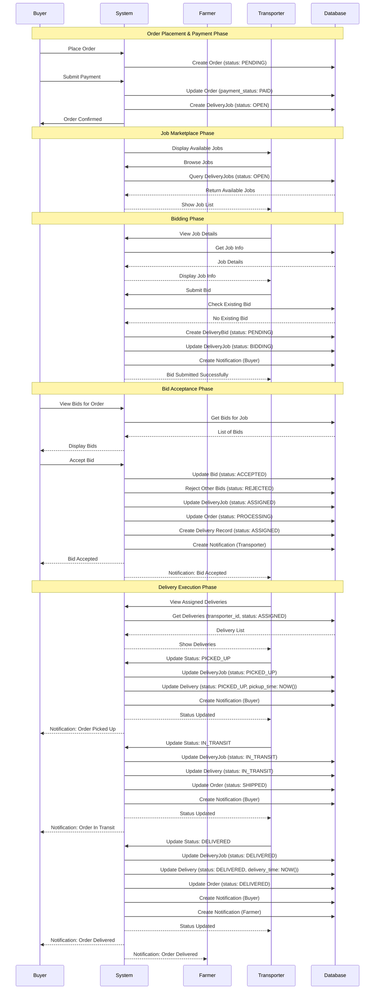

# Delivery Workflow Sequence Diagram

This document describes the complete delivery workflow sequence for the AgroHaat platform.

## Sequence Diagram (Mermaid Format)



## Workflow Steps

### 1. Order Placement & Payment
1. Buyer places order
2. Buyer submits payment
3. System creates delivery job (status: OPEN)
4. Order status: PENDING → PAID → CONFIRMED

### 2. Job Marketplace
1. System displays available jobs to transporters
2. Transporters browse jobs with filters
3. Transporter views job details

### 3. Bidding Phase
1. Transporter submits bid with amount and optional message
2. System validates bid (no duplicate, capacity check)
3. System creates bid (status: PENDING)
4. System updates job status to BIDDING
5. System notifies buyer of new bid

### 4. Bid Acceptance
1. Buyer views all bids for their order
2. Buyer selects and accepts a bid
3. System accepts selected bid (status: ACCEPTED)
4. System rejects all other bids (status: REJECTED)
5. System updates job status to ASSIGNED
6. System creates delivery record
7. System notifies transporter

### 5. Delivery Execution
1. **PICKED_UP**: Transporter collects products from farmer
   - Updates status to PICKED_UP
   - Records pickup_time
   - Notifies buyer

2. **IN_TRANSIT**: Transporter starts delivery
   - Updates status to IN_TRANSIT
   - Updates order status to SHIPPED
   - Notifies buyer

3. **DELIVERED**: Transporter completes delivery
   - Updates status to DELIVERED
   - Records delivery_time
   - Updates order status to DELIVERED
   - Notifies buyer and farmer

## Status Flow Diagram

```
Order Status Flow:
PENDING → PAID → CONFIRMED → PROCESSING → SHIPPED → DELIVERED

Delivery Job Status Flow:
OPEN → BIDDING → ASSIGNED → PICKED_UP → IN_TRANSIT → DELIVERED

Bid Status Flow:
PENDING → ACCEPTED (or REJECTED)

Delivery Record Status Flow:
ASSIGNED → PICKED_UP → IN_TRANSIT → DELIVERED
```

## Database Tables Involved

1. **orders** - Order information and payment status
2. **deliveryjobs** - Delivery job creation and status
3. **deliverybids** - Transporter bids on jobs
4. **deliveries** - Detailed delivery tracking
5. **notifications** - User notifications
6. **transporter_profiles** - Transporter vehicle and capacity info

## API Endpoints Used

- `GET /api/transporter/jobs.php` - List available jobs
- `POST /api/transporter/bids/create.php` - Create bid
- `POST /api/transporter/bids/accept.php` - Accept bid (buyer)
- `POST /api/transporter/deliveries/update.php` - Update delivery status
- `GET /api/transporter/deliveries.php` - List deliveries

## Key Validations

1. **Bid Creation:**
   - Job must be OPEN or BIDDING
   - Order payment must be PAID
   - Transporter must not have existing bid
   - Job weight must not exceed vehicle capacity

2. **Bid Acceptance:**
   - Buyer must own the order
   - Bid must be PENDING
   - Job must be OPEN or BIDDING

3. **Status Updates:**
   - Transporter must have ACCEPTED bid
   - Status must follow progression order
   - Cannot skip or go backwards

---

**Last Updated:** 2025-01-27

