# UML Class Diagram for Product Listing

This document contains the UML class diagram for the Farmer Module product listing system.

## Class Diagram (Mermaid Format)

```mermaid
classDiagram
    class User {
        -BigInt user_id
        -String full_name
        -String email
        -String phone_number
        -String password_hash
        -Enum role
        -String division
        -String district
        -String upazila
        -String address_details
        -Boolean is_verified
        -Boolean is_deleted
        -Timestamp created_at
        +registerFarmer()
        +loginFarmer()
    }

    class Product {
        -BigInt product_id
        -BigInt farmer_id
        -BigInt category_id
        -String title
        -String description
        -Decimal quantity_available
        -String unit
        -Decimal price_per_unit
        -Enum quality_grade
        -String image_url
        -Date harvest_date
        -String batch_number
        -String trace_id
        -String qr_code_url
        -Enum status
        -Boolean is_deleted
        -Timestamp created_at
        -Timestamp updated_at
        +getByFarmer(farmer_id)
        +create(data)
        +find(product_id, farmer_id)
        +findByTraceId(trace_id)
        +update(product_id, farmer_id, data)
        +delete(product_id, farmer_id)
        +getAllActive()
        +search(search_term, filters)
        +getById(product_id)
        +getSearchCount(filters)
    }

    class ProductController {
        -Product model
        -PDO pdo
        +__construct(pdo)
        +handleCreate(farmer_id)
        +handleUpdate(farmer_id, product_id)
        +handleDelete(farmer_id, product_id)
        +getProductsForFarmer(farmer_id)
        +getProductForFarmer(farmer_id, product_id)
    }

    class Order {
        -BigInt order_id
        -BigInt buyer_id
        -BigInt farmer_id
        -Decimal total_amount
        -Enum status
        -Enum payment_status
        -String shipping_address
        -Timestamp created_at
        -Timestamp updated_at
        +getForFarmer(farmer_id)
        +getForBuyer(buyer_id)
        +getByIdForBuyer(order_id, buyer_id)
        +create(buyer_id, farmer_id, total, address)
        +updatePaymentStatus(order_id, user_id, status)
    }

    class OrderController {
        -Order model
        -PDO pdo
        +__construct(pdo)
        +getFarmerOrders(farmer_id)
    }

    class Message {
        -BigInt message_id
        -BigInt order_id
        -BigInt sender_id
        -BigInt receiver_id
        -String content
        -Timestamp created_at
        +getForOrder(order_id)
        +create(order_id, sender_id, receiver_id, content)
    }

    class MessageController {
        -Message messageModel
        -Order orderModel
        -PDO pdo
        +__construct(pdo)
        +ensureFarmerOwnsOrder(farmer_id, order_id, pdo)
        +getMessagesForOrder(order_id)
        +sendMessage(order_id, sender_id, receiver_id, content)
    }

    class FarmerAuthController {
        -User userModel
        -String error
        +__construct(pdo)
        +handleRegister()
        +handleLogin()
        +logout()
    }

    class Category {
        -BigInt category_id
        -String name
        -String description
    }

    class OrderItem {
        -BigInt item_id
        -BigInt order_id
        -BigInt product_id
        -Decimal quantity
        -Decimal unit_price
        -Decimal subtotal
        -Timestamp created_at
    }

    %% Relationships
    User "1" --> "*" Product : owns
    User "1" --> "*" Order : places/receives
    Product "1" --> "*" OrderItem : included_in
    Order "1" --> "*" OrderItem : contains
    Order "1" --> "*" Message : has_messages
    Product "*" --> "1" Category : belongs_to
    
    ProductController ..> Product : uses
    OrderController ..> Order : uses
    MessageController ..> Message : uses
    MessageController ..> Order : uses
    FarmerAuthController ..> User : uses
```

## Class Descriptions

### User
Represents a user in the system. Can be a FARMER, BUYER, TRANSPORTER, or ADMIN.

**Key Attributes:**
- `user_id`: Primary key
- `role`: User role (FARMER, BUYER, TRANSPORTER, ADMIN)
- `full_name`, `email`, `phone_number`: User identification
- `division`, `district`, `upazila`: Location information

**Key Methods:**
- `registerFarmer()`: Register a new farmer account
- `loginFarmer()`: Authenticate farmer login

---

### Product
Represents a product listing created by a farmer.

**Key Attributes:**
- `product_id`: Primary key
- `farmer_id`: Foreign key to User (farmer who owns the product)
- `category_id`: Foreign key to Category
- `title`, `description`: Product information
- `quantity_available`, `unit`: Stock information
- `price_per_unit`: Pricing
- `quality_grade`: Quality rating (A, B, C, EXPORT_QUALITY)
- `image_url`: Product image path
- `trace_id`: Unique traceability identifier
- `qr_code_url`: QR code image URL
- `status`: Product status (ACTIVE, INACTIVE, SOLD_OUT)
- `is_deleted`: Soft delete flag

**Key Methods:**
- `getByFarmer(farmer_id)`: Get all products for a farmer
- `create(data)`: Create a new product
- `find(product_id, farmer_id)`: Find product by ID (with ownership check)
- `update(product_id, farmer_id, data)`: Update product
- `delete(product_id, farmer_id)`: Soft delete product
- `findByTraceId(trace_id)`: Find product by trace ID

---

### ProductController
Handles business logic for product operations.

**Key Methods:**
- `handleCreate(farmer_id)`: Process product creation (handles image upload, QR generation)
- `handleUpdate(farmer_id, product_id)`: Process product updates
- `handleDelete(farmer_id, product_id)`: Process product deletion
- `getProductsForFarmer(farmer_id)`: Get all products for a farmer
- `getProductForFarmer(farmer_id, product_id)`: Get single product with ownership check

---

### Order
Represents an order placed by a buyer for farmer's products.

**Key Attributes:**
- `order_id`: Primary key
- `buyer_id`: Foreign key to User (buyer)
- `farmer_id`: Foreign key to User (farmer)
- `total_amount`: Order total
- `status`: Order status (PENDING, CONFIRMED, PROCESSING, SHIPPED, DELIVERED, CANCELLED)
- `payment_status`: Payment status (UNPAID, PENDING, PAID, PARTIAL, REFUNDED)
- `shipping_address`: Delivery address

**Key Methods:**
- `getForFarmer(farmer_id)`: Get all orders for a farmer
- `getForBuyer(buyer_id)`: Get all orders for a buyer
- `create(buyer_id, farmer_id, total, address)`: Create a new order
- `updatePaymentStatus(order_id, user_id, status)`: Update payment status

---

### OrderController
Handles business logic for order operations.

**Key Methods:**
- `getFarmerOrders(farmer_id)`: Get all orders for a farmer

---

### Message
Represents a chat message between users (farmer, buyer, transporter).

**Key Attributes:**
- `message_id`: Primary key
- `order_id`: Foreign key to Order (chat is order-specific)
- `sender_id`: Foreign key to User (message sender)
- `receiver_id`: Foreign key to User (message receiver)
- `content`: Message text
- `created_at`: Message timestamp

**Key Methods:**
- `getForOrder(order_id)`: Get all messages for an order
- `create(order_id, sender_id, receiver_id, content)`: Create a new message

---

### MessageController
Handles business logic for messaging operations.

**Key Methods:**
- `getMessagesForOrder(order_id)`: Get messages for an order
- `sendMessage(order_id, sender_id, receiver_id, content)`: Send a message
- `ensureFarmerOwnsOrder(farmer_id, order_id, pdo)`: Verify order ownership

---

### FarmerAuthController
Handles farmer authentication operations.

**Key Methods:**
- `handleRegister()`: Process farmer registration
- `handleLogin()`: Process farmer login
- `logout()`: Handle logout

---

## Relationships

1. **User → Product (1 to Many)**
   - One farmer can have many products
   - Relationship: `farmer_id` foreign key in Product

2. **User → Order (1 to Many)**
   - One buyer can place many orders
   - One farmer can receive many orders
   - Relationships: `buyer_id` and `farmer_id` foreign keys in Order

3. **Product → OrderItem (1 to Many)**
   - One product can be in many order items
   - Relationship: `product_id` foreign key in OrderItem

4. **Order → OrderItem (1 to Many)**
   - One order can contain many order items
   - Relationship: `order_id` foreign key in OrderItem

5. **Order → Message (1 to Many)**
   - One order can have many messages
   - Relationship: `order_id` foreign key in Message

6. **Product → Category (Many to 1)**
   - Many products belong to one category
   - Relationship: `category_id` foreign key in Product

## Sequence Diagram: Product Creation

## Sequence Diagram: Order Management

---

**Last Updated:** 2025-01-27

