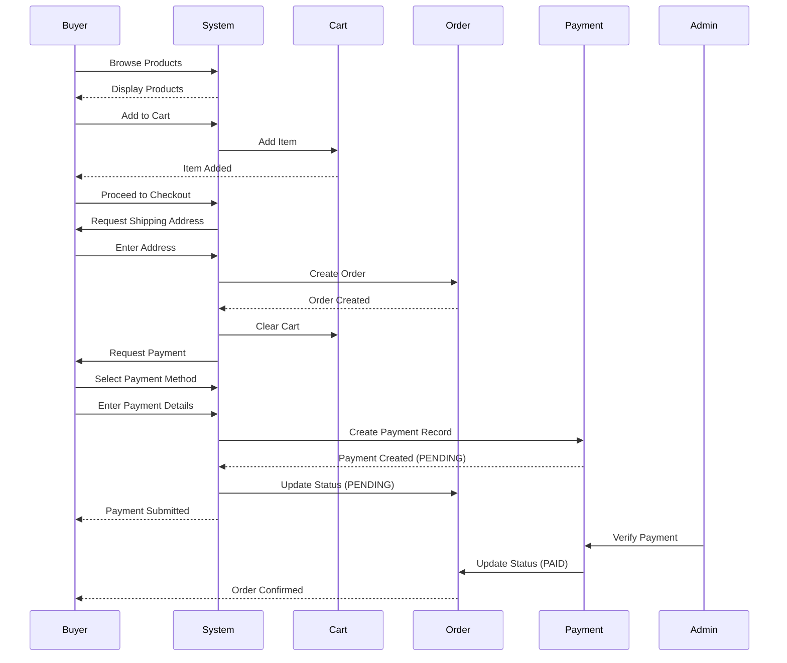

# Use Case: Buyer Places Order

## Use Case Specification

**Use Case ID:** UC-BUYER-001  
**Use Case Name:** Buyer Places Order  
**Version:** 1.0  
**Date:** 2025-01-27  
**Author:** AgroHaat Development Team

---

## 1. Overview

**Description:**  
A buyer browses products, adds items to cart, creates an order, and completes payment to purchase agricultural products from farmers on the AgroHaat platform.

**Goal:**  
Enable buyers to successfully place orders for agricultural products with secure payment processing.

---

## 2. Actors

**Primary Actor:**
- **Buyer** - Registered user who wants to purchase products

**Secondary Actors:**
- **System** - AgroHaat platform
- **Farmer** - Product seller (passive role in this use case)
- **Admin** - Payment verifier (passive role in this use case)
- **Payment Gateway** - External payment service (bKash, Nagad, etc.)

---

## 3. Preconditions

1. Buyer must be registered and logged into the system
2. Buyer must have a valid session
3. At least one product must be available in the marketplace
4. Buyer's cart must contain at least one item (for checkout flow)
5. Payment methods must be configured in the system

---

## 4. Main Success Scenario (Basic Flow)

1. **Browse Products**
   - Buyer navigates to the shop/marketplace page
   - System displays available products
   - Buyer can search and filter products by category, location, price, quality

2. **View Product Details**
   - Buyer clicks on a product to view details
   - System displays product information (title, price, description, farmer info, images, quality grade, harvest date, batch number)

3. **Add to Cart**
   - Buyer selects quantity and clicks "Add to Cart"
   - System validates product availability
   - System adds product to buyer's cart (session)
   - System confirms item added to cart

4. **Review Cart**
   - Buyer navigates to cart page
   - System displays all cart items with quantities and prices
   - Buyer can update quantities or remove items
   - System calculates and displays cart total

5. **Proceed to Checkout**
   - Buyer clicks "Proceed to Checkout"
   - System validates cart is not empty
   - System redirects to checkout page

6. **Enter Shipping Address**
   - Buyer enters shipping address
   - System validates address is not empty
   - Buyer clicks "Create Order"

7. **Create Order**
   - System creates order record in database
   - System creates order items for each cart product
   - System calculates order total
   - System clears buyer's cart
   - System redirects to payment page with order ID

8. **Select Payment Method**
   - System displays available payment methods (bKash, Nagad, Rocket, Card, Bank Transfer)
   - Buyer selects preferred payment method
   - System displays payment instructions for selected method

9. **Enter Payment Details**
   - **If Mobile Banking (bKash/Nagad/Rocket):**
     - Buyer follows payment instructions
     - Buyer enters transaction ID
   - **If Card Payment:**
     - Buyer enters card details (number, expiry, CVV)
   - **If Bank Transfer:**
     - Buyer enters bank transfer details

10. **Submit Payment**
    - Buyer clicks "Submit Payment"
    - System validates payment details
    - System creates payment record with status PENDING
    - System updates order payment_status to PENDING
    - System displays payment confirmation message

11. **Payment Verification** (Background Process)
    - Admin reviews payment
    - Admin verifies transaction
    - System updates payment status to COMPLETED
    - System updates order payment_status to PAID
    - System updates order status to CONFIRMED
    - System creates delivery job
    - System notifies buyer of payment confirmation

12. **Order Confirmation**
    - Buyer receives confirmation on dashboard
    - Buyer can view order in "My Orders"
    - Buyer can track order status

---

## 5. Alternative Flows

### 5A. Buyer Not Logged In
- **At Step 1-3:** If buyer is not logged in
  - System redirects to login page
  - After login, buyer returns to previous page
  - Flow continues from step 1

### 5B. Product Out of Stock
- **At Step 3:** If product quantity is insufficient
  - System displays error: "Insufficient quantity available"
  - Buyer can reduce quantity or remove item
  - Flow continues from step 3

### 5C. Empty Cart
- **At Step 5:** If cart is empty
  - System displays error: "Your cart is empty"
  - System redirects to shop page
  - Flow returns to step 1

### 5D. Invalid Shipping Address
- **At Step 6:** If shipping address is empty or invalid
  - System displays error: "Please provide a valid shipping address"
  - Buyer corrects address
  - Flow continues from step 6

### 5E. Order Creation Failed
- **At Step 7:** If order creation fails
  - System displays error: "Order creation failed. Please try again."
  - Buyer can retry or contact support
  - Flow returns to step 5

### 5F. Payment Method Not Available
- **At Step 8:** If selected payment method is unavailable
  - System displays error: "Payment method unavailable"
  - Buyer selects alternative payment method
  - Flow continues from step 8

### 5G. Invalid Payment Details
- **At Step 9:** If payment details are invalid
  - System displays validation error
  - Buyer corrects payment details
  - Flow continues from step 9

### 5H. Payment Submission Failed
- **At Step 10:** If payment submission fails
  - System displays error: "Payment submission failed"
  - Buyer can retry payment
  - Flow returns to step 8

### 5I. Payment Rejected by Admin
- **At Step 11:** If admin rejects payment
  - System updates payment status to FAILED
  - System notifies buyer of rejection
  - Buyer can submit new payment
  - Flow returns to step 8

### 5J. Buyer Cancels Order
- **At Any Step:** Buyer can cancel the process
  - System returns buyer to previous page
  - Cart items are preserved
  - No order is created

---

## 6. Postconditions

**Success Postconditions:**
1. Order is created in the system
2. Order items are recorded
3. Payment record is created with PENDING status
4. Order status is set to PENDING
5. Cart is cleared
6. Buyer receives order confirmation
7. Delivery job is created after payment verification

**Failure Postconditions:**
1. No order is created
2. Cart items are preserved
3. No payment is processed
4. Buyer can retry the process

---

## 7. Business Rules

1. **Minimum Order:** No minimum order amount required
2. **Payment Methods:** Buyer can choose from available payment methods
3. **Payment Verification:** All payments require admin verification (mock system)
4. **Order Status:** Order status progresses: PENDING → CONFIRMED → PROCESSING → SHIPPED → DELIVERED
5. **Payment Status:** Payment status: UNPAID → PENDING → PAID
6. **Cart Persistence:** Cart is stored in session and cleared after order creation
7. **Product Availability:** System checks product availability before adding to cart

---

## 8. Special Requirements

1. **Security:** All payment details must be encrypted
2. **Session Management:** Buyer session must remain active throughout the process
3. **Data Validation:** All user inputs must be validated
4. **Error Handling:** Clear error messages must be displayed
5. **Transaction Integrity:** Order creation and payment must be atomic operations
6. **Audit Trail:** All order and payment actions must be logged

---

## 9. Technology and Implementation Details

**Frontend:**
- PHP with Bootstrap for UI
- JavaScript for form validation
- Session management for cart

**Backend:**
- PHP controllers (BuyerController)
- Models (Order, Payment, Product)
- MySQL database

**Payment Integration:**
- Mock payment system (admin verification)
- Support for bKash, Nagad, Rocket, Cards, Bank Transfer
- Transaction ID collection for mobile banking

**Database Tables:**
- `orders` - Order records
- `order_items` - Order line items
- `payments` - Payment records
- `payment_methods` - Available payment methods
- `products` - Product information

---

## 10. Assumptions

1. Buyer has internet connection
2. Buyer has valid payment method account (if using mobile banking)
3. Admin will verify payments in a timely manner
4. Products are available when buyer adds to cart
5. System is available and functioning

---

## 11. Open Issues

1. Real-time payment gateway integration (currently mock)
2. Automatic payment verification (currently manual admin verification)
3. Order cancellation by buyer
4. Partial payment support
5. Payment retry mechanism

---

## 12. Related Use Cases

- **UC-BUYER-002:** Buyer Views Order History
- **UC-BUYER-003:** Buyer Tracks Order Status
- **UC-ADMIN-001:** Admin Verifies Payment
- **UC-FARMER-001:** Farmer Receives Order Notification

---

## 13. Activity Diagram

---

**Document Status:** Complete  
**Last Updated:** 2025-01-27

